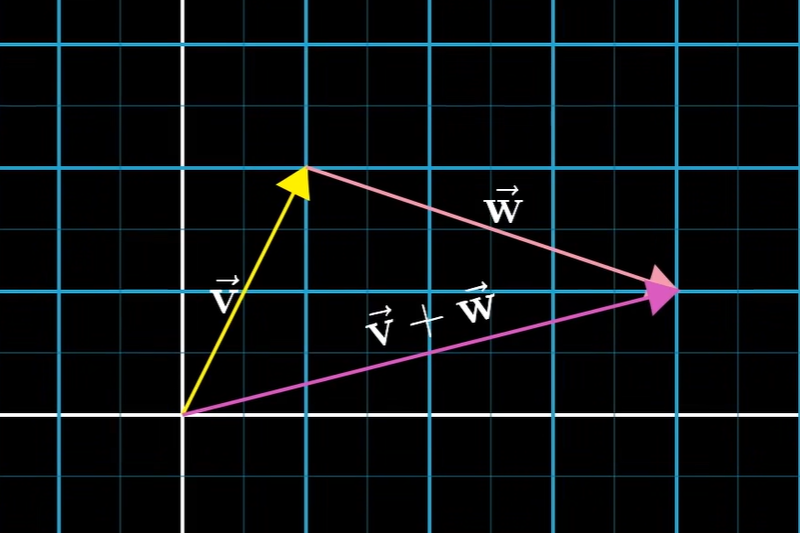

# 向量

向量可以理解为对一个事物的各个特征的一个表示。向量的每一个分量代表一个特征，而对向量的表示应该看成一个整体，如二维平面的向量所表示的含义就是一个箭头。


## 二维坐标表示

如坐标轴二维向量[1,2]：第一个特征代表的是向右，第二个特征代表的是向上。

那整体所代表的含义就是一个箭头，它向左走了一步，又向上走了两步。


## 现实表示

- 房价：如房子的价格分析，可以通过房子的面积和价格进行建模，房子有两个特征，第一个是面积，第二个是价格，那同样的可以通过二维向量进行表示，如：90平230万，120平300万等等

```
[90,230]
[120,300]
[60,180]
```

- 大语言模型：Transformer最常见的Token，比如一个词，可以由token来表示，而token其实就是一个向量，这个向量可以二维，也可以很多维，即一个词语你可以用两个特征表示，也可以用多个特征来进行表示，而更多维度的表示所能体现的词的含义就会更丰富饱满。

```
[0.4561,0.1231,0.4564,0.1456...]
```

- 计算机视觉：对于人眼所看到的图片和视频，是五颜六色的，但是对于计算机是不明白颜色的含义，在底层只有二进制的数学表示，那么对于一张图片，可以通过向量抽象地进行表示，而每一个维度就代表每一个像素块，每一个像素块的值所代表的就是rgb数值。


## 向量的加法

向量的加法可以理解为所抽象出来的模型相加，那么两个模型本身就是抽象的，再相加就更抽象了，所以通过数学的表示来说，向量的相加所代表的就是向量的各个分量相加。

那怎么去理解两个模型的相加呢，最简单的还是以二维坐标箭头为例子，两个箭头的相加，其实就是将第二个箭头连结到第一个箭头之上，由原点画一条直线，如下图所示。



那其实这种箭头的相加，就是V[1,2]和W[3,-1]相加，V所代表的含义就是向左一步，向上两步，W所代表的含义是向左三步，向下一步。所以最终就是向左3+1为四步，向上2-1为一步，最终的向量就是[4,1]。

那对于现实计算机表示的模型，可以理解为相加，就是对各个分量特征的相加的结果，结果是新的一个相加后的模型。

## 向量的乘法

向量的乘法我觉得比加法是要好理解的，乘法其实对于向量其实就是一个缩放的效果，对所有的特征进行一个放大或放小。

## 基向量

基向量可以理解为就是一个基础的向量，基向量本质也是一个向量，用来定义这个模型和空间的基本单位。

如何定义基向量呢？

我们可以先挑任意两个向量，那么任意两个向量可以通过各种**线性组合**（v = ai + bj）就是两个向量乘各自缩放倍数再相加，所组成的一个空间和集合，理论上可以扩展到整个空间，我们称之为叫**张成空间**，那么有两种情况：

- 张成空间还是一条直线
- 张成空间变成一个面，对维度有贡献

我们说任意两个向量，对张成空间维度有贡献的，称之为**线性无关**。对张成空间维度没贡献的叫做**线性相关**，可以理解为就是第二个向量和第一个向量是处于同一个维度，同一个直线，没法进行扩展，所以叫做线性相关。

那么我们定义基向量，就是必须是两个线性无关的向量才能叫做基向量。扩展到三维或更高维度也是同理的。

## 基向量的变换

我们喜欢习惯性思维，正常的坐标轴其实基向量就是[1,0]和[0,1]，但是通过各种各样的线性变换，其实本质就是对基向量的变换，基向量可以变换成各种各样的，可以是斜着的，倒转的，翻转的等等，所代表的数值都是不一样的。

如旋转90度，就是[0,1]，[-1,0]两个基向量，而随之在原来坐标轴上的v向量，也会跟着基向量一同变换，这就引出了矩阵的概念了，且听下回分解~